# Analysing PPSSPP RAM with IDA Pro

In this walkthrough, to demonstrate the process, we will tackle a sample problem. We want to learn more about GTA Vice City Stories USA (later referred to as GTA:VCS) internal logic that handles in-game time of day, in particular, how and where the in‑game hour changes from 23 to 0 (right after 23:59 in in-game time of day). 

**The problem**: PSP (as emulated by PPSSPP) has limited RAM, and as such, games have to load and unload data often. As such, there is no guarantee that our in-game data is always present.

This walkthrough is not intended to be definitive and ultimate; it simply reflects the author’s perspective on the best approach.

## Requirements
* IDA Pro (with typically-present `psp` decompiler, ensure activated)
* PPSSPP (tested on PPSSPP v1.20.4)

* [🟢Optional] 💵ArtMoney – for alternate RAM dumping pathway and some relevant cheats. Ensure activated, select English for easier navigation. If ArtMoney is used, you may also find useful:
	- ArtMoney emulation options: https://www.artmoney.ru/e_download_emul.htm (as PPSSPP emulation options stayed the same since ~12 years ago, this step can likely be skipped)
	- ArtMoney tables: https://www.artmoney.ru/artmoneytables.exe (which cover ~50 PSP games)

At the time of writing, Windows is recommended (PPSSPP debugger is traditionally only available on Windows; ArtMoney is a Windows-only software)

### Game ROM requirements

* The game ROM itself (use legally obtained ROMs)
* [Strongly Recommended for Part 2] Some relevant cheats or patches that contain parameters relevant to the logic analyzed. For instance, the address of main character's health on runtime, to enable analysis of health-processing functions.

## Part 1: Start the game, ensure target logic is generally loaded

This part ensures high probability that the code we are interested in will be available in the RAM dump.

In this example, we are analysing GTA:VCS handling of the time of day. Thus we need to get to the point where the handling for the time of day should generally happen gameplay-wise, and then proceed to the next part. Always err on the safe side. Refer to the examples below,

### When NOT to proceed

 | 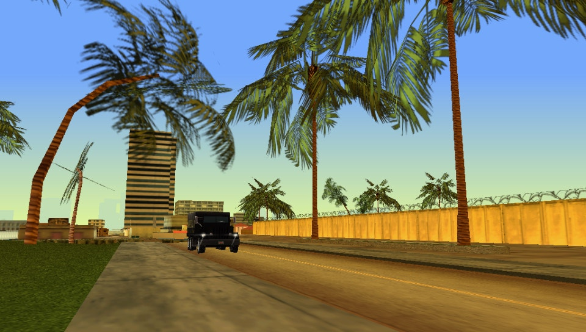 | 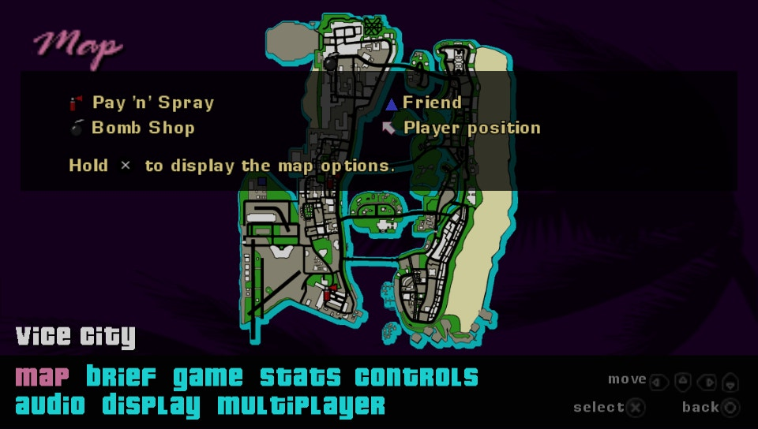 
---- | ---- | ---- 
Game not yet fully loaded, and likely time of day code and data are not loaded | Even though the cutscene is using time of day, we don't know if time of day handling is loaded | Err on the safe side. As no time of day handling occurs during in-game pause, assume it is not loaded

### When to proceed

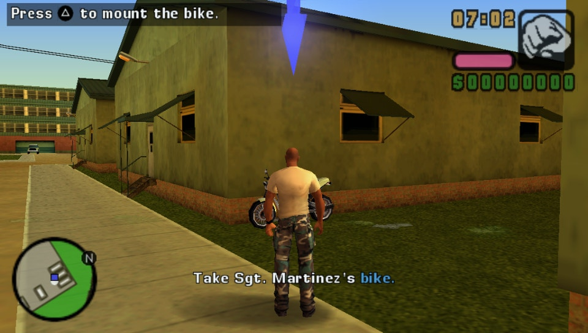 | 
---- |
In-game timer is visible, ticking, and affecting gameplay

## Part 2: Find a relevant parameter

This part is necessary to ensure the relevant code is actually loaded.

In our example, we are analysing GTA:VCS handling of the time of day, we may need the addresses for any parameters relevant to time-of-day handling. 

This information can be obtained by the analyst by themselves (e.g., through reverse engineering or finding parameters), or by using pre-existing sources such as cwCheat (requires conversion to emulated addresses), cheat device plugins, ArtMoney tables, CheatEngine tables, or other means. Some relevant cheats or patches that contain parameters relevant to the logic analyzed can be quite helpful.


Below are the steps taken for our particular example. Recall that in our example in particular, I analyze how and where the in‑game hour changes from 23 to 0 (right after 23:59 in in-game's time of day). 

### Example step 2.1: Find a relevant parameter

I already know from my own ArtMoney table that the in-game hour is stored at the address of `0x8BB3B40`.

We can use minutes, too, but I opted to use hours for a breakpoint.

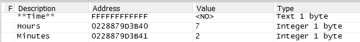 |  
---- |
Note: in ArtMoney, "Address" is the PC address. I need Emul. Address shown below.

### Example step 2.2: Confirm parameter validity for the game ROM and session

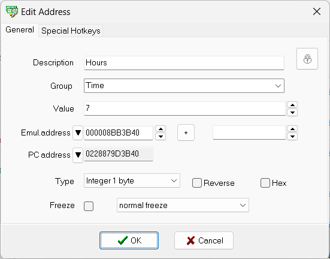 | 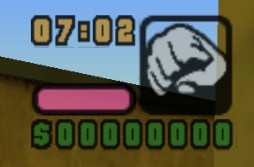
---- | ----
More information | HUD

## Part 3: Save state, then put a breakpoint 

In PPSSPP, start the PPSSPP debugger. We need an address of data with our target parameter from part 2. Once we have it, put a breakpoint on address **write + on change** in PPSSPP debugger

### Example step 3.1: Save state

In PPSSPP, press <kbd>F2</kbd>.

This step solves 3 problems at once:
1. If the code/data used for the breakpoint is volatile and changes on game load/save reload/gameplay, then the code/data will stay at the same location for this breakpoint.
2. In case emulator crashes or a mistake is made, you can easily go back.
3. Can be used in part 4 after part 3 in a more streamlined manner.

Note: You can load state later by pressing <kbd>F4</kbd>.

### Example step 3.2: Add a breakpoint

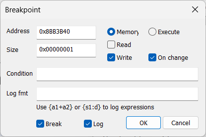 | 
---- |
Don't forget to click "OK"


Data | Value | Explanation
---- | ---- | ----
Address | 0x8BB3B40 | As confirmed in step 2.2
Size | 1 (0x00000001) | Corresponding to 1 byte integer
Breakpoint Type | "Memory" (not "Execute") | Because the address contains data in memory, not an instruction to be executed
Conditions | ✔️Write ✔️On_Change | Occasionally changing data in memory that is best watched against these conditions.


## Part 4: Go through breakpoint hits to gather more information

Recall that in our example in particular, I analyze how and where the in‑game hour changes from 23 to 0 (right after 23:59 in in-game time of day). As such 

1. Get the game time to hit midnight

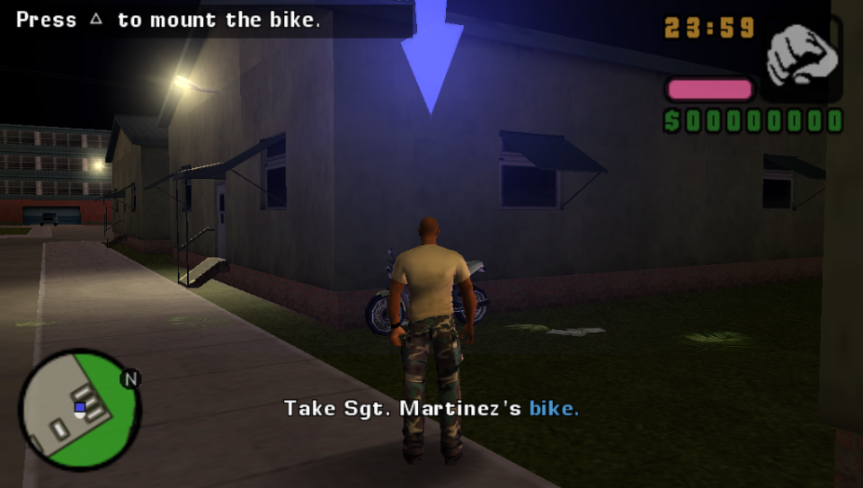 | 
----  |
PPSSPP - In-game near midnight

2. Observe the breakpoint being hit.

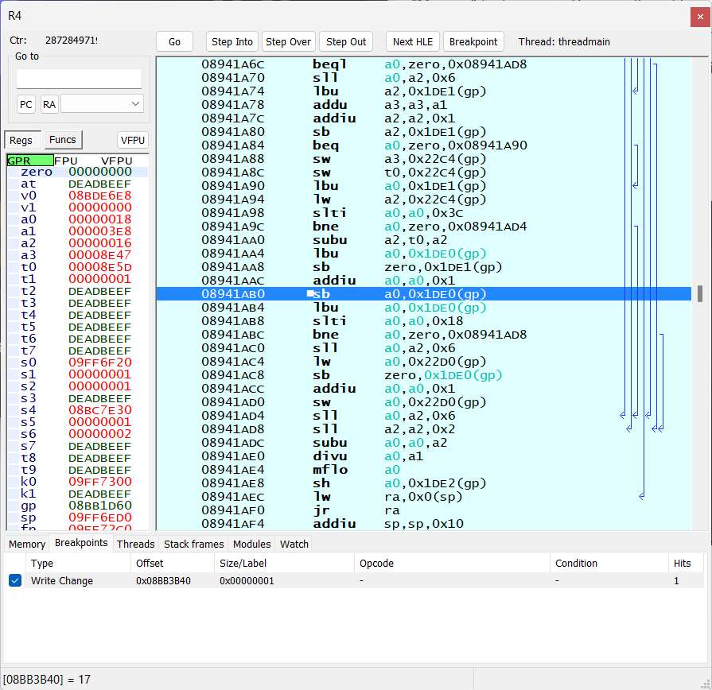 | 
----  | 
PPSSPP Debugger - hit at 08941AB0

3. Note the address in debugger where the breakpoint is hit. Click "Go". Observe if the same breakpoint is hit at addresses from **other functions** in PPSSPP debugger. Fewer hits from other functions yields easier analysis.

 (basically, same function means the same background color AND you can trace no background color changes from the previous hit)

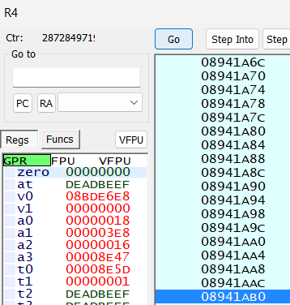 | 
----  |
"Go"

* I got another hit at `08941AC8`, which is a **different** address, but still within the **same** function

	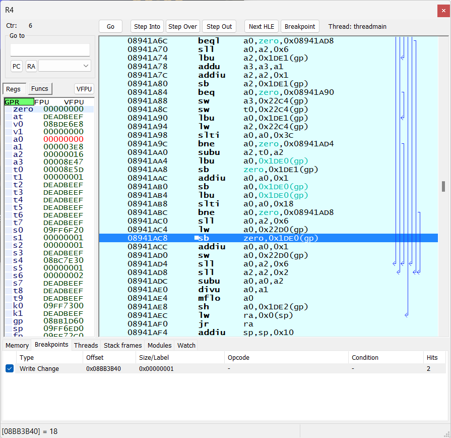 | 
	---- | 
	PPSSPP Debugger - hit at 08941AC8

The result: 2 hits, `0x08941AB0` and `0x08941AC8` , but both are within the same PPSSPP debugger function, so we only need to focus on **1 function** later in IDA Pro.

## Part 5: For each function, hit a breakpoint, and dump

*Most of the time, one dump for all functions where a breakpoint was hit is fine (especially if all breakpoints are hit within one frame). However, this walkthrough takes a safer approach to ensure correctness of the resulting dumps*

Recall that in our example in particular, I analyze how and where the in‑game hour changes from 23 to 0 (right after 23:59 in in-game time of day). 

### 5.1 Hit a Breakpoint

By pressing <kbd>F4</kbd> can load state, which was saved in part 3, step 3.1, and add the breakpoint again at the same place as before (part 3, step 3.2)

Repeat some of the steps from part 3: Get the game time to hit midnight, observe the breakpoint being hit, but just once.

1. Get the game time to hit midnight

 | 
---- |
PPSSPP - In-game near midnight

2. Observe the breakpoint being hit,

 | 
----  | 
PPSSPP Debugger - hit at 08941AB0


**Once the breakpoint is hit, the game is paused, and we can safely dump in the next step**

### 5.2 Dump

There are 2 options for this step: either to dump with PPSSPP (simpler, recommended) or to dump with ArtMoney.

#### Option 1: Dump with 🌐PPSSPP (simpler, recommended)

1. In PPSSPP,  navigate to Debug → Memory view (<kbd>Ctrl + M</kbd>)  

2. In "Memory Viewer" window, right-click in the memory area and select "Dump"  

3. Ensure that "Location" selected is "RAM".  

4. Click on `...` and ensure to save the dump at a good location with a meaningful name (such as `Tutorial`). Then, click "OK"  
'
5. Take a note of pre-set Start (`0x08800000`) and Size (`0x01800000`). Finally, in "Dump memory" window, click "OK"  

6. Observe success  
'

**Do NOT close PPSSPP yet, do not unpause the game in debugger**

#### Option 2: Dump with 💵ArtMoney
(navigate the UI)

Once the breakpoint is hit, do

1. In ArtMoney, click on "🔎Search" (we won't really 'Search' for anything)
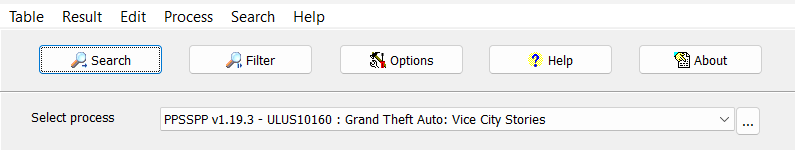

2. In the newly opened window, for "Search" field, select "Save a memory dump"
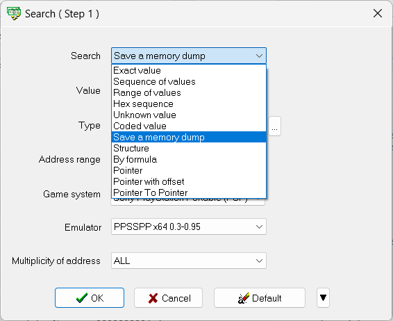

3. Then, for "Emulator" field, ensure to select "PPSSPP x64 0.96+" or "PPSSPP 0.96+".
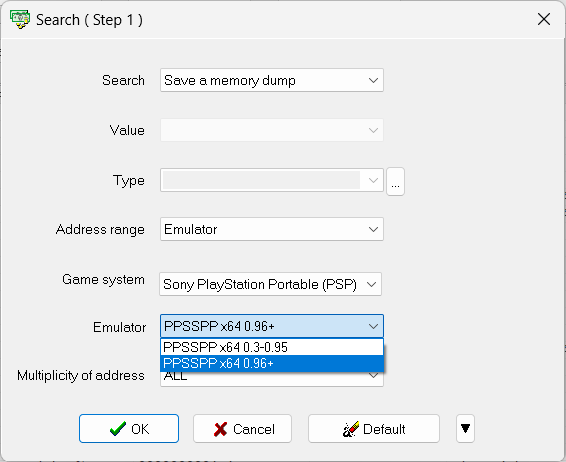

4. Click "✅OK",
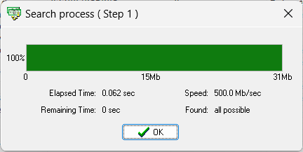

5. Once "Search process ( Step 1 )" is complete, click another "✅OK". Observe "all possible" and "Filter until the number..." tips being printed at the bottom of the ArtMoney main window,
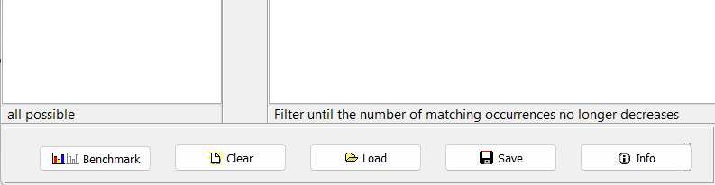

6. Right-click on the **left** side of ArtMoney main window's white space - Click "Save the filtration"
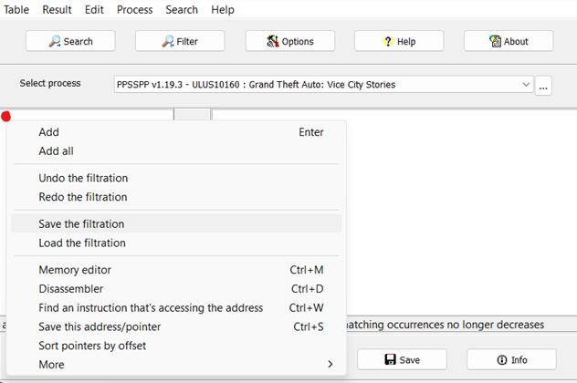

7. Give it a meaningful name, e.g., "Tutorial", then click "Save"
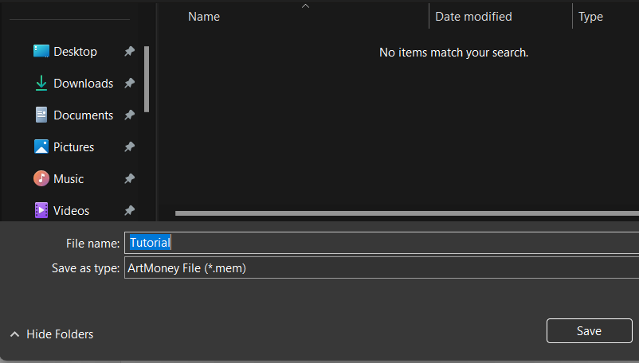

**Do NOT close PPSSPP yet, do not unpause the game in debugger**

## Part 6: Open dump(s) in IDA Pro

*Most of the time, one dump for all functions is good (especially if all breakpoints are hit within one frame). However, this walkthrough assumes a safer approach by utilizing multiple dumps.*

For each the dump(s), perform the following steps:

### 6.1 Open file in IDA Pro

1. Open IDA Pro
2. File → Open
3. Open the dump
	- For 🌐PPSSPP-generated dumps: In the previously-set location, locate the dump file.
	- For 💵ArtMoney-generated dumps: Browse to ArtMoney installation path (e.g., `C:\Games\ArtMoney`) → `Data` → (a meaningful name, e.g. `Tutorial`) with an extension **`.mem`** (for example, `Tutorial.mem`)
	(the nice aspect about ArtMoney is that it saves memory dump data in a separate file from the memory dump metadata and properties)

### 6.2 Configure initial CPU settings

PSP uses a custom Allegrex 32-bit Little-endian RISC CPU, [reference](http://daifukkat.su/docs/psptek/).

1. For Processor Type, change:
```
- From: 📁Intel 80x86 processors → 🗎Meta PC  (metapc)
- __To: 📁MIPS series → 🗎Sony PSP (Allegrex) (psp)
```

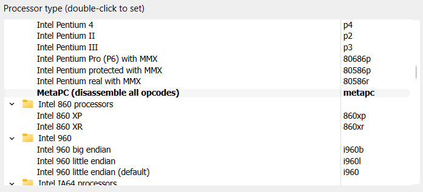 | 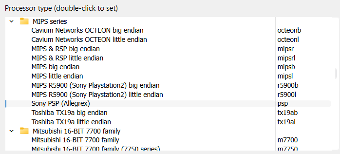 | 
---- | ---- |
Old (generic) | New (correct and precise)

2. Click OK
3. Do you want to change the processor type to psp? → [ Yes ]

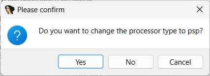 | 
---- | 
Do you want to change the processor type to psp? → [ Yes ]

### 6.3 Disassembly memory organization

(very important not to make any mistakes)

The following information was used for reference:

 | 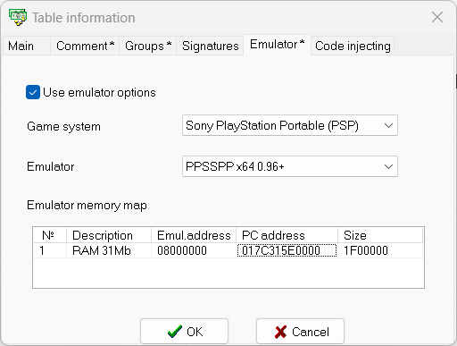
---- | ----
🌐PPSSPP-made dumps | 💵ArtMoney-made dumps

#### Configuration

1. **RAM Section** (Enable and configure):  
   - **☑ Create RAM section** –  **☑Checked**
   - **RAM start address**: 
		- 0x0**88**00000 for 🌐PPSSPP-made dumps
		- 0x0**80**00000 for 💵ArtMoney-made dumps
   - **RAM size**: **(same as 'Loading size')**
	   - `0x01800000` for 🌐PPSSPP-made dumps
	   - `0x01F00000` for 💵ArtMoney-made dumps
2. **ROM Section** (Disable since you're loading RAM):  
   - **☐ Create ROM section**  – ☐*Unchecked*
   - **ROM size**: `0x0`  (**must be set to 0x0 even with ROM unchecked**)
3. **Input File Settings**:  
   - **Loading address**:
		- 0x0**88**00000 for 🌐PPSSPP-made dumps
		- 0x0**80**00000 for 💵ArtMoney-made dumps
   - **File offset**: `0x0` (the dump starts at the beginning of the file)  
   - **Loading size**: **(default, full size of the RAM dump)**
	   - `0x01800000` for 🌐PPSSPP-made dumps
	   - `0x01F00000` for 💵ArtMoney-made dumps

Click **OK** to apply. You may also refer to screenshots below,

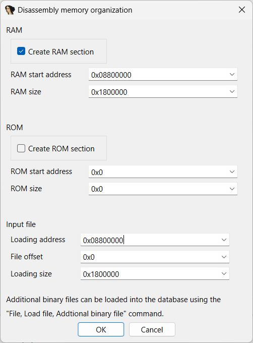 | 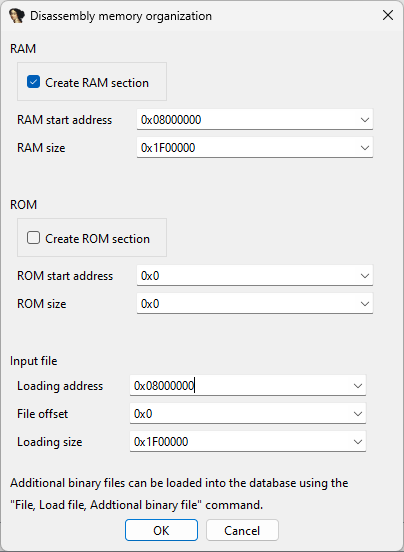 | 
---- | ----
🌐PPSSPP-made dumps | 💵ArtMoney-made dumps

#### 🌐PPSSPP-made dumps: The Resulting Setup
| Section         | Field               | Value        |
|-----------------|---------------------|--------------|
| **RAM**         | Create RAM section  | ☑ **Checked** |
|                 | RAM start address   | `0x08800000` |
|                 | RAM size            | `0x01800000`  |
| **ROM**         | Create ROM section  | ☐ *Unchecked* |
|                 | ROM size            | `0x0` (**important**)  |
| **Input File**  | Loading address     | `0x08800000` |
|                 | File offset         | `0x0`        |
|                 | Loading size        | `0x01800000`  |


#### 💵ArtMoney-made dumps: The Resulting Setup
| Section         | Field               | Value        |
|-----------------|---------------------|--------------|
| **RAM**         | Create RAM section  | ☑ **Checked** |
|                 | RAM start address   | `0x08000000` |
|                 | RAM size            | `0x1F00000`  |
| **ROM**         | Create ROM section  | ☐ *Unchecked* |
|                 | ROM size            | `0x0` (**important**)  |
| **Input File**  | Loading address     | `0x08000000` |
|                 | File offset         | `0x0`        |
|                 | Loading size        | `0x1F00000`  |


#### Why These Settings?
- **RAM Configuration**:  
  The PSP's RAM is mapped to an offset during runtime. By setting the RAM start address to `0x08000000` (0x0**88**00000 for PPSSPP-made dumps / 0x0**80**00000 for ArtMoney-made dumps), you define the valid memory range for disassembly.  
- **ROM Disabled AND Unused**:  
  Since your input is a RAM dump (not ROM), unchecking "Create ROM section" avoids conflicts. Despite this, ROM Size must additionally be set to `0x0` to prevent IDA Pro from incorrectly creating a ROM section (despite "ROM Section" allocation being unticked).

### 6.4 Disassemble in 64-bit or 32-bit?

Q: Disassemble in 64-bit or 32-bit?
A: Since Sony PSP is 32-bit, disassemble in 32-bit. Hence the answer for the question of "Do you want to disassemble it as 64-bit code?" is "No"

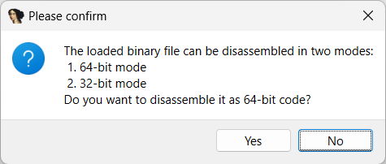 | 
---- |
Do you want to disassemble it as 64-bit code? → [ No ]

### 6.5 Sanity check (avoid bogus sections)


If all is done correctly, **there must not be the black separator in the middle of listings** legend of IDA Pro. Its presence implies that IDA created 2 sections (RAM and ROM, where there must only be one (RAM)

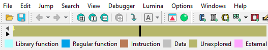 | 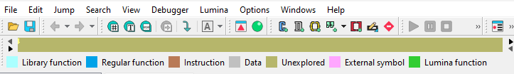
---- | ----
**Bad** an additional incorrect section was created by IDA | **Good**. No middle separator, only one section was allocated by IDA

If you encounter the 'bad' result, restart from step 6.1

----

**Do NOT close PPSSPP yet, do not unpause the game in debugger**

## Part 7: Analyze dump(s) in IDA Pro using PPSSPP Debugger data

**The problem**: Even though a PPSSPP dump is correctly loaded into IDA Pro, IDA Pro would not know where to start analyzing.
**My solution**: Use PPSSPP debugger to address this problem.

For each the dump(s), perform the following steps:

### 7.1 In PPSSPP debugger

1. In PPSSPP debugger, access "Funcs" button,

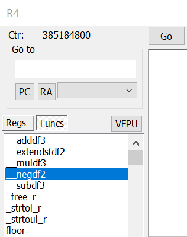 |
---- |
Funcs tab

2. Locate the first "z_un_..." function. Usually it would be **08804000**.

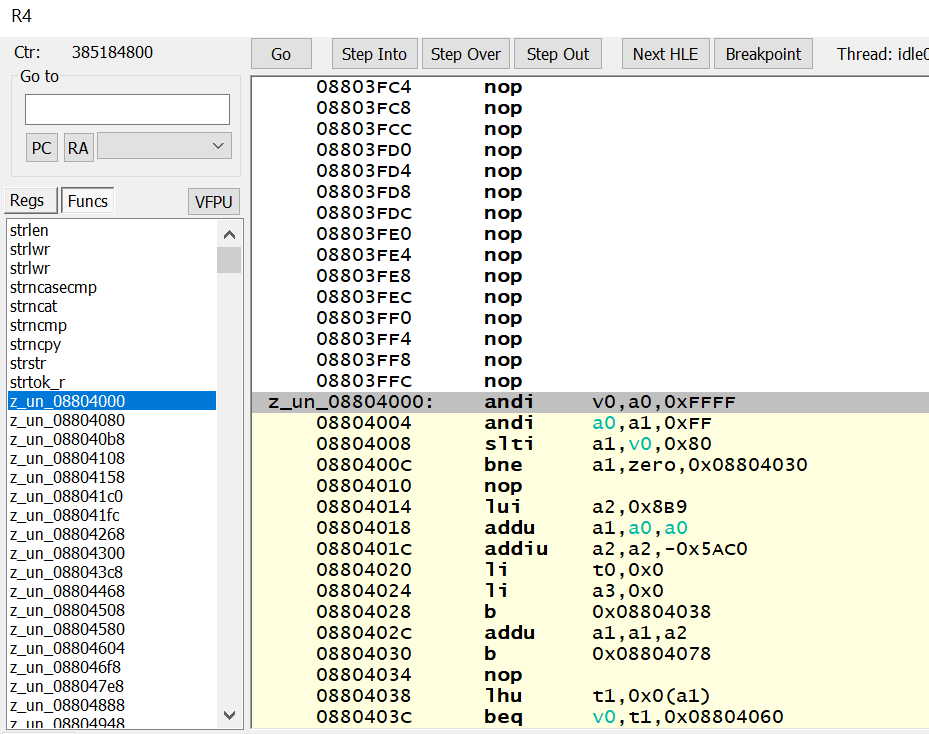 |
---- |
First z_un_... function

3. Locate the last "z_un" function AND locate its last address

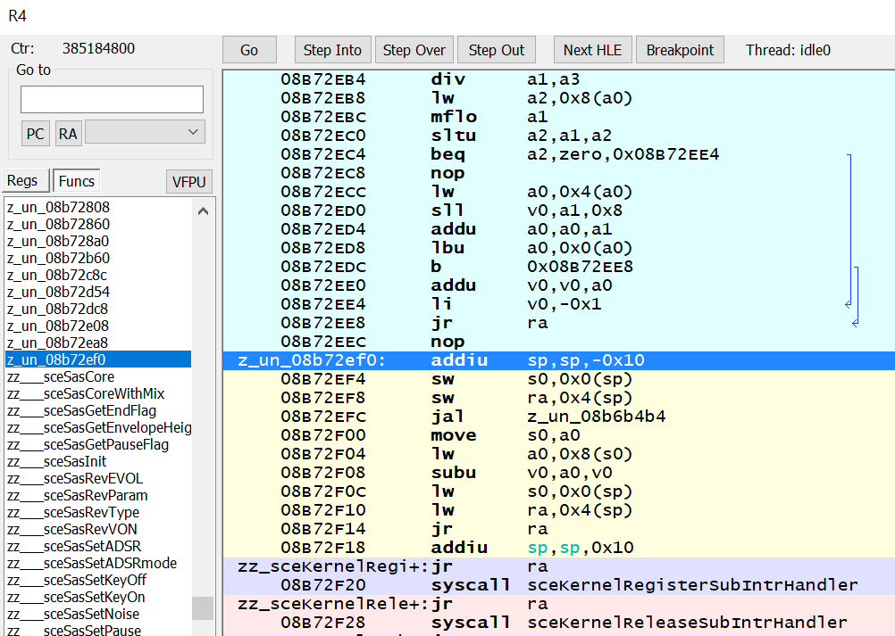  | 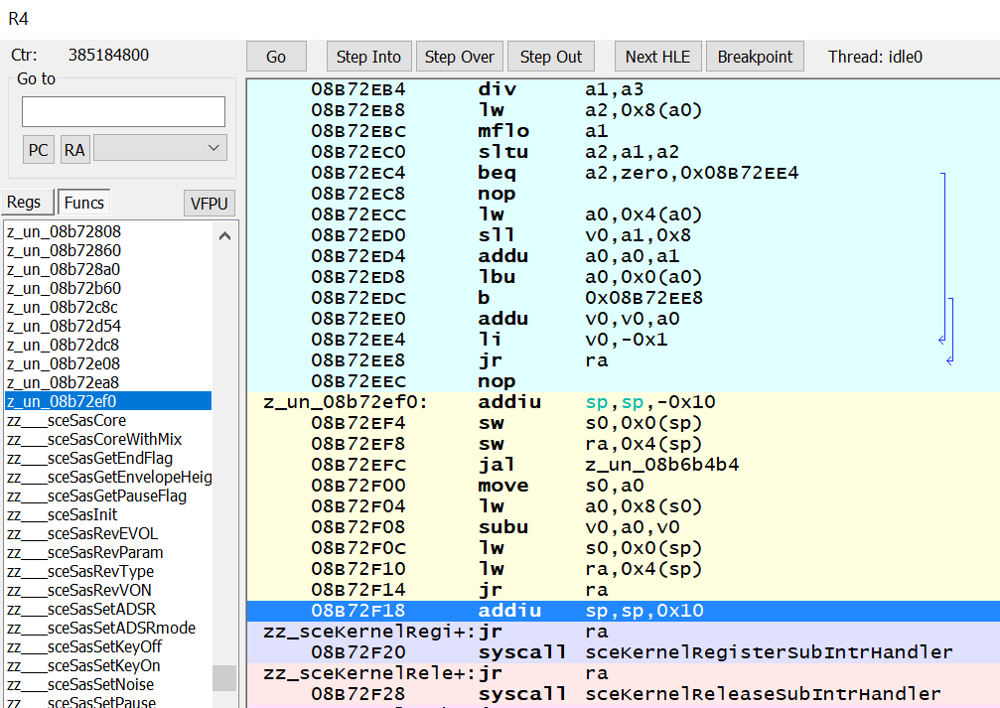
---- | ----
Last function | Last function's last address

In this example: last "z_un" function is at 08B72EF0, and its last address is at **08B72F18**

4. Remember the **range**: 08804000 - 08B72F18

### 7.2 IDA v9.2: Force-creating code and functions
IDA as of 9.2, does not always create Allegrex functions. Based on [this tip](https://hex-rays.com/blog/igors-tip-of-the-week-152-force-creating-functions), force-create a function.

In IDA Pro,
1. Press <kbd>G</kbd> (for 'goto'), paste the **range start** address (<kbd>Ctrl+V</kbd>), e.g., `08804000`  

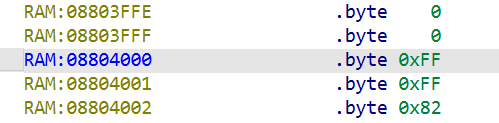

2. While staying on the first instruction of the function, use Edit > Begin selection  
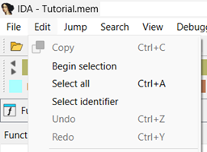
3. Press <kbd>G</kbd> (for 'goto'), paste the **range end** address (<kbd>Ctrl+V</kbd>), e.g., `08B72F18`  
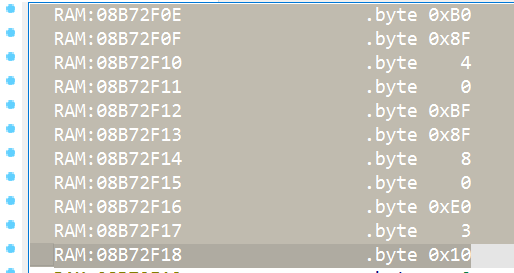

4. Press <kbd>C</kbd> (force ©️Code )
5. Where asked, force a conversion to code,

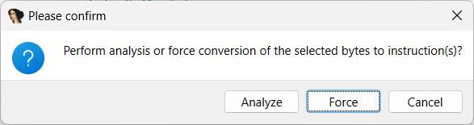 | 
---- | 
"Perform analysis or force conversion of the selected bytes to instruction(s)?" → [Force]

6. IDA Pro should hang for a minute, but if steps were done correctly, it should not crash.  
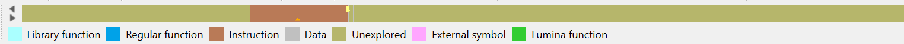

## Result

Now that out analysis is complete, let's go back to the address of the instruction where our breakpoint was hit: `08941AB0`
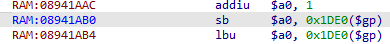

Press <kbd>F5</kbd> (decompile).

The result (I added some labels and used decimal constants)

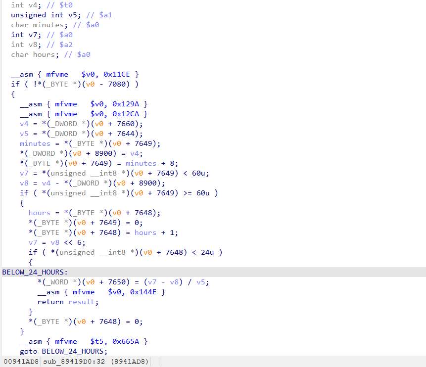

You may also produce a C-file for analysis by accessing File -> Produce file -> Create C file (or <kbd>Ctrl+F5</kbd>).

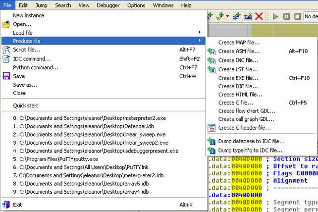

## Troubleshooting appendix

- Breakpoint never hits → confirm the save-state is before an event is due to occur
- IDA Pro crashes after forcing the conversion → Verify that the correct address range is used.
- Dump looks wrong in IDA → verify correct settings were used in step 6.3
- Too many hits → optimize based on the parameter used from part 2 (e.g., use hours instead of minutes to avoid dealing with too many hits)

---------------------------------
**Tim Abdiukov**
