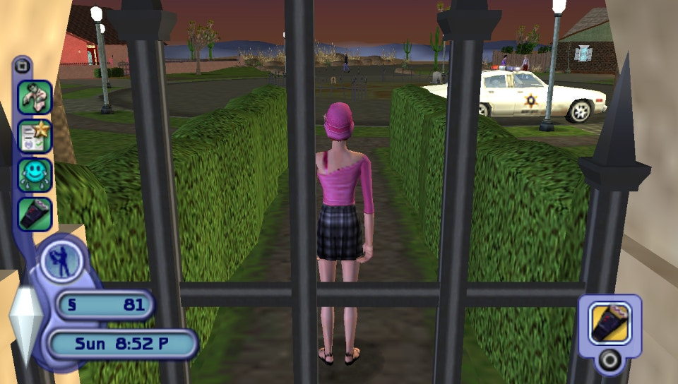
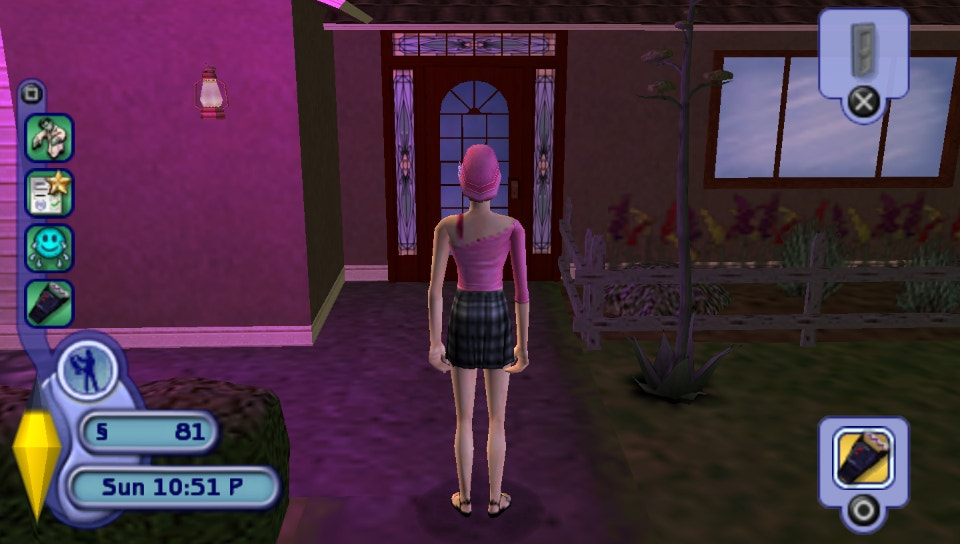
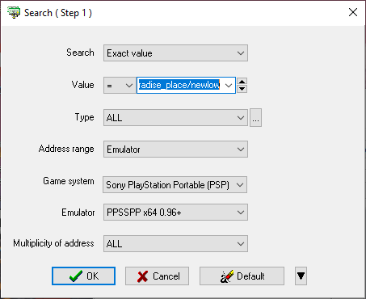
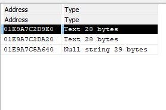
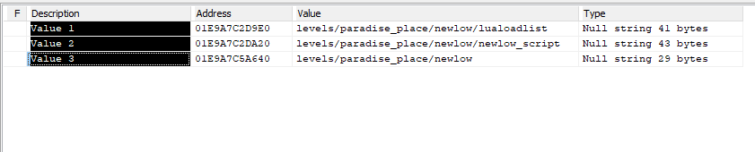
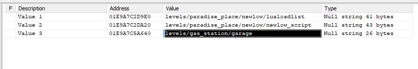
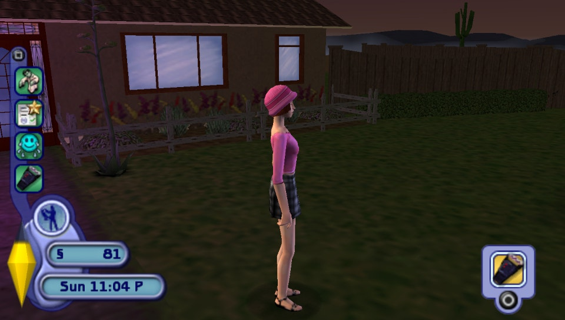
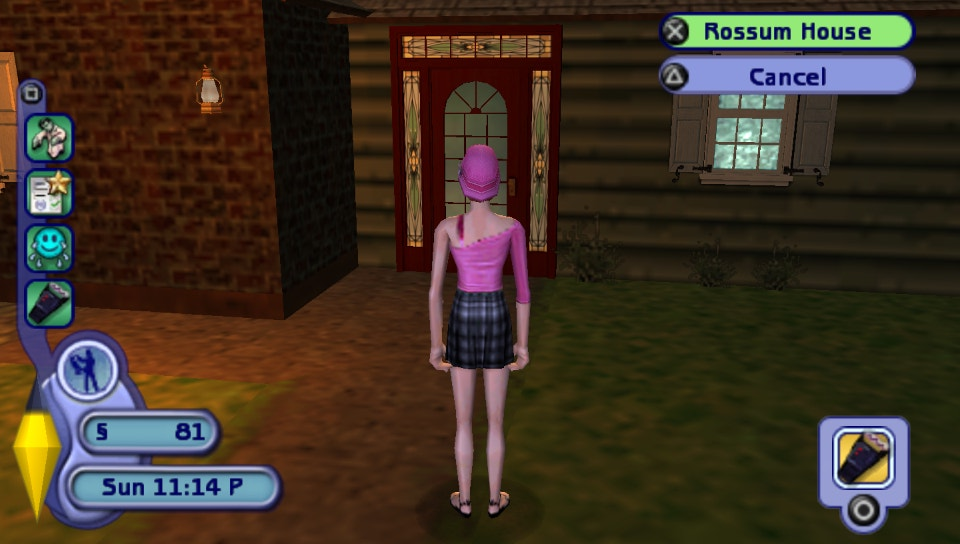
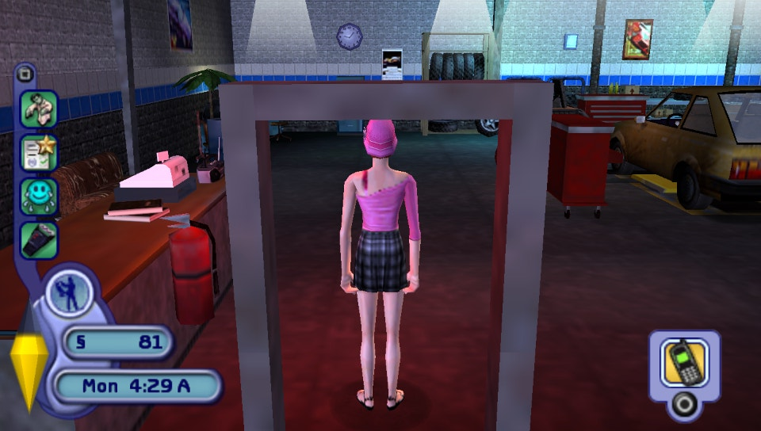

# Sims 2, The – Teleport Anywhere

## Trivia

The game is segregated across the locations/levels. Teleporting is only possible at the exits/TP points (doors).

### Terms

Term | Meaning
---- | ----
Location | same as level
TP point | TP point – teleport point. All doors, roads, exits, etc. – that get you to another location (level)
Teleport FROM level | Where you are
Teleport THRU level | Which TP point is used
Teleport   TO level | Target location

## All levels

Note: some levels may be invalid.

```
levels/cas
levels/deadtree/graveyard
levels/deadtree/hub
levels/deadtree/kine
levels/deadtree/kine/cutscene/cincowthulu
levels/deadtree/library
levels/deadtree/saloon
levels/division_47/barracks
levels/division_47/hub
levels/division_47/lab
levels/division_47/secret_sublevel
levels/front_end/fe_planetselect/supplemental/border.tif
levels/gas_station/curio_shop
levels/gas_station/garage
levels/gas_station/hub
levels/gas_station/hub/cutscene/cinintro
levels/interface/mainmenu
levels/paradise_place/beaker
levels/paradise_place/doss
levels/paradise_place/espiritu
levels/paradise_place/hub
levels/paradise_place/newlow
levels/paradise_place/rossum
levels/simple
levels/test_levels/key_object_test
levels/test_levels/xtian
levels/the_monument
levels/the_monument/cutscene/cinfinale
```

## Guide

### Preparatory Step 0: Find optimal TP point.

This is a technical step. **If confused, go straight to the "Solutions" section.**

What does optimal mean?

1) Available
2) Contains a TP point (exit) to the lengthiest possible level

**Q**: Why "available"?

**A**: To ensure it can be used. For example, Division47 is not available in the early game (beyond the gate that is, where the TP locations are)

**Q**: Why "Contains a TP point (exit) to the lengthiest possible level"

**A**: The answer is not simple. If you intend to teleport to a lengthy location (such as `levels/division_47/secret_sublevel`) through a shorter location (such as `levels/deadtree/kine`), some part of the memory gets corrupted. In this example

```
BYTES: 1234567890123456789012345678901234
_THRU: levels/deadtree/kine
___TO: levels/division_47/secret_sublevel

_DIFF: 34 - 20 = 14 bytes (get corrupted)
```
Conversely, if one teleports to the shorter location ("DIFF" is less than or equal to 0), memory is not corrupted.

To reduce memory corruption, it is best to teleport through the lengthiest possible level.

#### Solutions

Below are the best possible levels to teleport THRU

* Best early-most game, len=29:
	```
	levels/gas_station/curio_shop
	```
* Second best most of the game, len=28
	```
	levels/paradise_place/beaker
	levels/paradise_place/newlow
	levels/paradise_place/rossum
	```
* Best very late game, len=34
	```
	levels/division_47/secret_sublevel
	```

##### Q&A about the solutions

**Q**: What about `levels/paradise_place/espiritu` (len=30)

**A**: `levels/paradise_place/espiritu` is over-referenced in the memory, it's too cumbersome to use this level.

**Q**: I noticed there is other information related to level THRU struct, should these be modified.

**A**: Practically, there is no effect when those are modified, even if they are modified to the broken values.

### Step 1: Get to location that complains that optimal TP point.

For example, for the TP point of `levels/gas_station/curio_shop`, get to the gas station

Or for `levels/paradise_place/newlow`, get to Paradise Place outdoors



*Getting to the location*



*There!*

### Step 2: Find the level THRU string in the memory

ArtMoney software is used in this guide

Helpful note: The string will always NULL-delimited.



*Searching for level THRU in the memory*



*Found 3 candidates*

3 Candidates? Interesting. But remember, our string needs to be NULL-delimited. Let's enforce that.



*Clearly, we are after "Value 3" (addr 0x01E9A7C5A640)*

### Step 3: Edit level THRU string to the desired one



*Let's go to the now-inaccessible garage, because why not?*

### Step 4: Walk away, and back to the TP point

The game gets slightly confused, so you need to reload the action. Just walk away from that door, and then walk back to it.



*Walking away from it. Notice that the "action" is no longer at the accessible distance.*


*Now walking back to it*

### Step 5: Action the level change



*It's time to go*

Now assuming we provided with a valid "level TO", Sim should teleport there.



*Voila.*

---------------------------------

***[Tim Abdiukov](https://github.com/TAbdiukov)***
