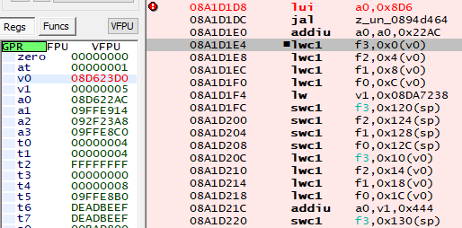

# TDU – Teleport anywhere, including secret islands
*or "assembly for beginners"*

Teleporting anywhere in TDU is easy, if you reverse-engineer the **`TP to marker - main [Enable]`** patch!

The guide was put together, as I reverse-engineered my own patch.

# Prerequisites

* PPSSPP for Windows (recommended, as it exclusively includes Debugger)
* TDU (Test Drive Unlimited) ISO. U.S. ROM (ULUS10249) is used in this guide.
* Memory editor such as CheatEngine or ArtMoney
	* Windows is highly recommended here, external memory editing is limited on other OSs
* [Notepad++](https://notepad-plus-plus.org) for PPSSPP-patches under-the-hood analysis.
* Human brain's analytical, aggregation and inference functionality.

# Main guide

## Step 1: Install TDU cheats

This guide uses U.S. ROM (ULUS10249). Hence, **`hacks_TDU_ULUS10249.ini.db`** is used

  

## Step 2: Enable **`TP to marker - main [Enable]`** and observe it working properly.

 |
---- |
"Cheats" menu in PPSSPP


Now, if the player opens a map and places a marker, then once the map is closed, the player is teleported to the marker.

## Step 3: Reverse-engineer the patch

**[I'm bored! Warp me to Teleporting Anywhere part!](#step-4-teleporting-anywhere)**

### Having a look at cheat file.

Let's have a closer look at the **`TP to marker - main`** pair of patches,

 |
---- |
Patch file in Notepad++

We can already investigate 2 leads, in any order,
* Investigate the patch itself
* Since I was courteous to make long and useful comments, we can investigate "the 08A1D250 reading". **[We will start here]**

### The 08A1D250 reading

Let's jump to 0x08A1D250 in Debugger
 |
---- |
**`0x08A1D250`** in Debugger

#### Inference

We can observe multiple series on **`lwc1`** and **`swc1`**. 

If we use brain's inference capabilities, we can easily guess: 
1) **L**oad **W**ord and **S**et **W**ord as the first 2 letters of the instructions, 
2) And since **F**-series of registers are used in the instructions, these MIPS instructions are floating-point instructions 
3) Since PSP addresses 32 MB at a time (according to ArtMoney's .emul), more than 1 page of **`2^16 / 2^10 = 64`** KB, we know that PSP CPU is at least a 32-bit CPU. Therefore, PSP CPU can address at least **`32/8 = 4`** bytes per instruction
4) Since we see that delta between offsets in the instructions is equal to 0x4, **`lwc1`** and therefore **`swc1`** manipulate 4 bytes at a time presented in float format. See picture below,  
	  
	
Therefore, **`lwc1`** and **`swc1`** should read and write 4 bytes of float at per instruction.

#### Easier route

Alternatively, you can Google **`lwc1`** and **`swc1`**. PSP CPU is MIPS-compatible, so the documentation should be possible to find.

#### More inference

 |
---- |
0x08A1D250 in Debugger

Again, we can notice sequences of:
1. Consecutive values at offsets off **`v0`** being loaded into CPU/FPU registers f3, f2, f1 and f0 
	* Note: Assembly order positioning is generally that: the first argument is the affected subject by the operation, as opposed to traditional programming and human language
3. Registers being written into another offset of **sp** (**S**tack **P**ointer)

Sequences run in sets of 4, which implies that the bytecode is compiled, and likely this is some sort of data structure instance copy routine.

### Catching in the act

Let's save game-state in the map mode. We will use this state to circumvent potential [DEP/ASLR](https://security.stackexchange.com/q/18556)/data allocation differences issues.

With **`TP to marker - main`** enabled, let's set a breakpoint on **`08A1D250`**. Simply double-click on the instruction row in the debugger.

Afterwards, let's try to teleport to the marker by editing map. The game execution should get stopped at **`08A1D250`**.

  

Since the bytecode at the address stands for 
```
lwc1	f3,0x30(v0)
```

let's examine **`v0`**,

 |
---- |
close-up

v0 is set to **`08D623D0`**. **`0x08D623D0 + 30h = 0x08D62400`**.

Since it must be interesting there, let's re-load the game state and examine data at that address with ArtMoney, with data presentation, as discussed in the inference section, being **`float 4 bytes`** .

  

And indeed, it looks like the game stores map marker position in 4x3=12 bytes starting from **`0x08D62400`** .

 |
---- |
Parameters

Let's partially confirm this by moving marker elsewhere with ArtMoney. For example, to the normally-impossible location of: **`40000,0,50000`**

 |
---- | 
Marker at an impossible location

### Gaining persistence

We are almost there! Now, all that's left is to ensure that we can find the marker address across game sessions/reloads etc.

For that, let's check out the patch file again,

 |
---- | 
Patch file in Notepad++

For both **`[enable]`** and **`[disable]`** patches, we perform 2 checks, and (as indicated by first digit **`2`** in the CWCheat instructions) 

We modify (in CWCheat's language, quote-unquote) **`0x2021D1D8`** and **`0x2021D1E0`**. These are not really addresses, but CWCheat instructions!

To get real addresses, we need to replace the first digit with **`0`** and add **`MAGIC`** (from `helpy.py`), which is **`0x08800000`**.

We get: **`0x8A1D1D8`** and **`0x8A1D1E0`**. Let's have a look at them in assembly.

 |
---- |
Assembly

Mathematics! The patch modifies mathematics (calculations) behind the address used for the player to use the pointer!

*Sidenote*: An alternative way to get here (without examining CWCheat patch instructions) was to examine the closest *jump-to* location (as detected by pretty smart Debugger, and outlined green in the screenshot) and guess that the calculations occur here.

Let's set up 2 breakpoints and try to see what is happening here.

 |
---- | 
Two breakpoints

What do we see?

* **`08A1D1D8`**: **`v0`** is set to some random small value. Here, CPU executes **`lui`** –  **L**oad **U**pper (top of the register) **I**mmediate (<ins>constant</ins> value) to **`a0`**. Hence, **`a0`** is set to **`08D60000`**  
	  
* **`08A1D1DC`**: **`jal`** – MIPS equivalent to x86's **CALL** (unfortunately, you have to either guess or know this) to some location. 
* **`08A1D1E0`**: However, before the jump, we execute one more instruction. This is a quite common behavior with some processor architectures, such as **6502**. What happens here? **`addiu`** – **Add** **I**mmediate... (<ins>constant</ins> value) something. As a result, **`a0`** is guaranteed to be set to **`a0+0x22AC=08D622AC`**  
 	  
	  
* **`0894D464`**: Luckily, it's a very small function! `jr ra` "jump register  (to) return address" (equivalent to **`ret`** in other architectures)  
	  
* **`0894D468`**: However, before ret, we execute one more instruction. This is a quite common behavior with some processor architectures, such as **6502**. **`addiu`** – **Add** **I**mmediate... (<ins>constant</ins> value) something. As a result, **v**0 is guaranteed to be set (overwritten) to **`a0+0x124=08D623D0`**  
	  
* **`08A1D1E4`**: And we are already at the variable-copying routine, **`v0`** is already set to a value **`0x30`** bytes away from marker position addresses! Backtracking is complete!

What did we learn? We learned that the marker position is calculated by game as follows,
```
0x08D60000+0x22AC+0x124+0x30
```

All of these addends are constant and no pointers are involved. we don't need to worry about memory allocation, pointers, etc.! This means that, if the same code is executed again (as it does, as determined empirically by the patch functionality over the years), the variable positioning in the memory is **constant**!

Furthermore, if we disable the patch, we can see that only the constant values used in the calculation are modified. Elegant!

 |  |
---- | ---- |
Patch disabled | Patch enabled

## Step 4: Teleporting Anywhere

You'll need the following addresses,

* **TP to marker - main [Disable]**:  
	X | Y | Z |
	---- | ---- | ---- |
	08D49568 | 08D4956C | 08D49570 |

* **TP to marker - main [Enable]**:  
	X | Y | Z |
	---- | ---- | ---- |
	08D62400 | 08D62404 | 08D62408 |

However, it's only **practical** to teleport with patch **`TP to marker - main [Enable]`** on and marker set, so it can be tracked. 

*Technical note*: There's an in-game animation on the marker. From this we can infer that the marker position has to be read, and hence re-drawn every frame, as opposed to being read upon its manipulation. Alternatively, it is possible to set a breakpoint on marker position axis at observing it/them being read at leastonce every frame (as a tiny bit of sound is played by the game at the frame processing end).

Therefore,
1. Import addresses to a memory editor (CheatEngine or ArtMoney)
2. Go to map mode, ensure the marker is set somewhere.
3. Adjust the marker, until you reach the desired location. For example, `64646,50,45120`
4. Exit map mode  
	  
5. Enjoy the result!

---------------------------------

***[Tim Abdiukov](https://github.com/TAbdiukov)***
