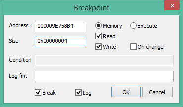
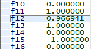
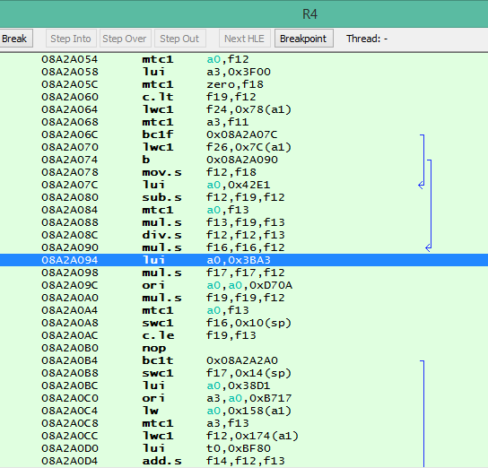

Daxter movement fixing notes

# theboy181 and Anuskuss' findings

> found out that if you push the stick up its 0.967777372 internally instead of 1
> Instead of the up moving from 0 - 1 it has odd floats. .98.
> When you point it to the position that up should be the value is 1 .5 .25

> when you use .25 it will go straight
> .5 it will go straight
> .75 ect
> but any number between will twist the controls

> NPUG80329 
> 0x09E75DD4 This is the Axis.. When its 1, .75 .5 .25 it walks straight. but any .float between these values will calculate the axis to the left. 

> When you press up (actual UP)  the float will be 1.0 and Zero when you are not moving.
> if you map the up to a key the float will = 0.9669408202

So the distilled findings  are

* For `X mod 0.25 == 0`, character goes straight
* For `NPUG80329` release, the movement parameter is at `0x09E75DD4`
* If character is:
	* controlled using DPAD, on pressing straight up, the parameter = 1.00
	* controlled using analog stick, on pressing straight up, the parameter = 0.9669408202

The latter finding is extremely benefitial for finding this parameter from scratch

## Finding the parameter
1. In the settings, set controls to be using the analog stick
2. Walk straight up
3. In external RAM editor, search for `0.9669408202`. Find ~20 candidates
4. Filter out using the other tricks
	* On "No movement", the value is 0.00
	* If game reads from dpad, on pressing "straight up", the value is "1.00"
	* Negative values mean "Moving backwards
	* Good old trial and error-ish "divide and conquer" - try freezing values at 0/1/-1, and see what happen

Ok, as I suspected, seems this parameter alone doesnt make the character lean to the left. It's easy to prove: if you freeze the parameter at 0.28, 0.97, 2 etc, the character will just run straight at 28%, 97%, 200% etc speed. It's all good, I'm working on the hack right now


## Moving on

Ok, let's try reading/writing to the parameter




Hook on reading: 000009E758B4

Reading:

Address | Analog/Dpad |  Offset | Notes
---- | ---- | ---- | ----
08A28B0C | Both | 0x1C | After Jr ra, in a small function
08A28CAC | Both | 0x1C | lwc1

Writing: 

Address | Analog/Dpad |  Offset | Notes
---- | ---- | ---- | ----
08A28D34 | Both | 0x1C | 1

### RA's

Address | RWE | Analog/Dpad |  RA | Notes
---- | ---- | ----  | ---- | ----
08A28B0C | R | Analog | 088D6BE4 / 088AECE0 |  
08A28CAC | R | Analog | 088D6F98 | 
08A28D34 | W | Analog | 088D6F98 | 
08A28B0C | R | Dpad | 088D6BE4 / 088AECE0 |  
08A28CAC | R | Dpad | 088D6F98 | 
08A28D34 | W | Dpad | 088D6F98 | 

Seem same, but `088D6F98` seems interesting since there happens both reading AND writing

### Tracing differences


Legend
* `S` - skipped for a good reason
* `+` - branch (condition = true)
* `-` - no branch (condition = false)
* `C` - cancaded (skipped) no branch
* `N` - never executed
* RA - return address (after func)

Extended legend
* `L` - explicit landing
* `O` - steppable over (no execution hijacked)
* `B` - unconditional branch
* `F` - executed, no need to continue debugging - further routine out of scope
* `e` - executed

Read: 08A28CAC
Write: 08A28D34

Interesting: 08A28D2C (f12 = 1 - f12,f12 = 0.0255...)

Analog: 1-f12 = 0.255



1-f12 = 0.03

f12 = 3F77896F

Address | Analog (all up)
---- | ----
088D6F98 | e
08A28C54 | e
08A28C68 | -
08A28CB0 | -
08A28CB8 | -
08A28CC4 | -
08A28CCC | -
08A28CD4 | O
08A28CFC | B
08A28CB0 | +
08A28D0C | +
08A28D14 | C
08A28D24 | -
08A28D2C | e
08A28D40 | +
08A28D50 | C
08A28D58 | L
08A28D64 | -
08A28D7C | +
08A28CB0 | -F
F | F


It's all impressive, but seems like the generic logic for correcting the percentage for the forward movement. BUT in the process, I found the Left/Right vector parameter address:
```
000009E75870 + 0x1C = 000009E7588C
```

### Going further

Hooking on write to: `000009E7588C`

Address | RWE | Notes
---- | ---- | ----
08A28D34 | W | 08A28D34


088D6F98 - weird


### Following the stack
```
->	088D6FA0
->	088DC854
->	088DD25C
```

### Another parameter

I thought I got stuck, but in the process I found another parameter nicknamed `A0+18` that affects y axis and which gets changed in different places

Address | RWE | Notes | On nop | 
---- | ---- | ---- | ----
08A2A664 | W | | sets to zero
08A2A2A8 | W | This is IT! | insofar sets to f1, which is zero
08A29918 | W | Nothing | insofar sets to f13, which is zero

0x08A2A2A8
f1  = 3E829369 
f16 = BE829369

08A2A760


### tracing the change

Address | State | state in HEX |  Condition
---- | ---- | ---- | ----
0x08A2A218 | 
... | 
0x08A2A2A8 | `f1==0.255031 ; f16==-0.255031` | f16==BE829369 | f1==0x3E829369


### ABRUPTED: Theboy's hack


```
_S UCUS98618
_G Daxter
_C0 Fix Anolog Controls *theboy181
_L 0x2022A094 0x3C043F80
_L 0x2022A09C 0x00000000
``` 

> no, basically the game constructs a constant by which it multiplies
> Theboy181 modifies the process so the game produces 1.00
> later on, the game ~~modifies~~ multiplies the values by 1

#### Original (USA) 

```
08A2A094:	lui	a0,0x3BA3
08A2A09C:	ori	a0,a0,0xD70A
```





Address | Old HEX | New Hex | Notes
---- | ---- | ---- | ----
08A2A094 | 3C043BA3 | 3C043F80 | hi bits
08A2A09C | 3484D70A | 00000000 | lo bits

#### Port to EUR


