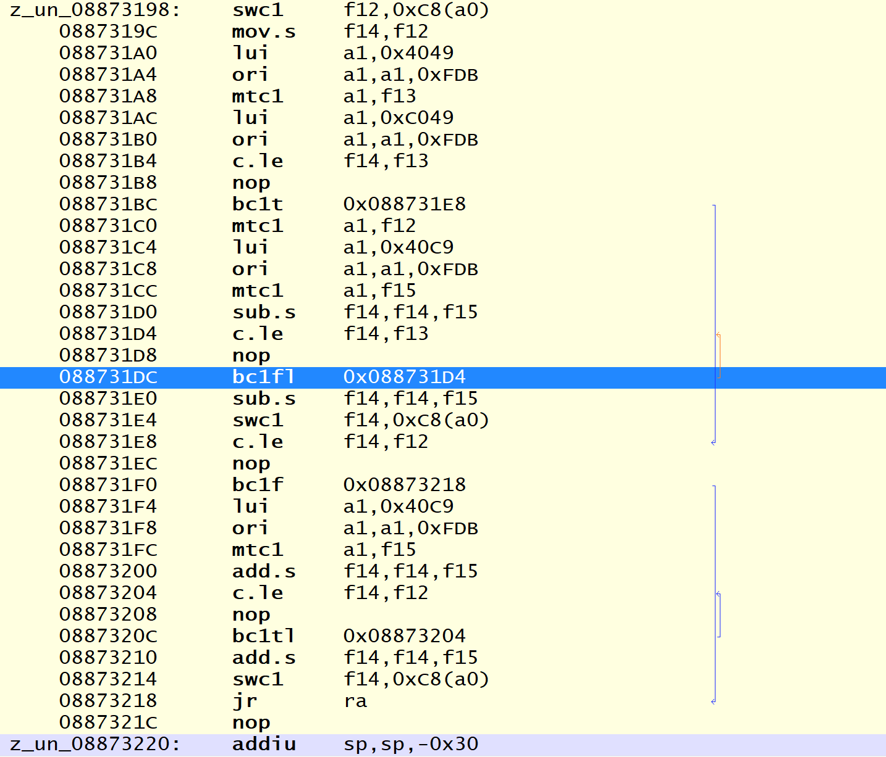
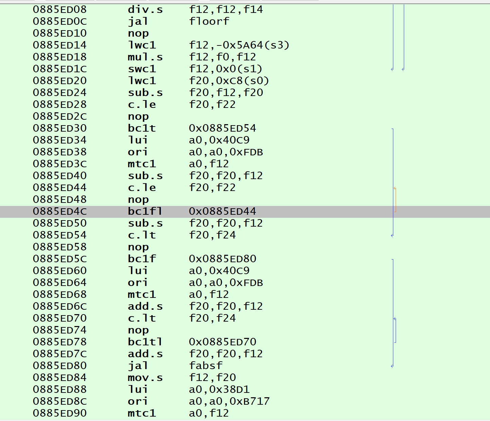
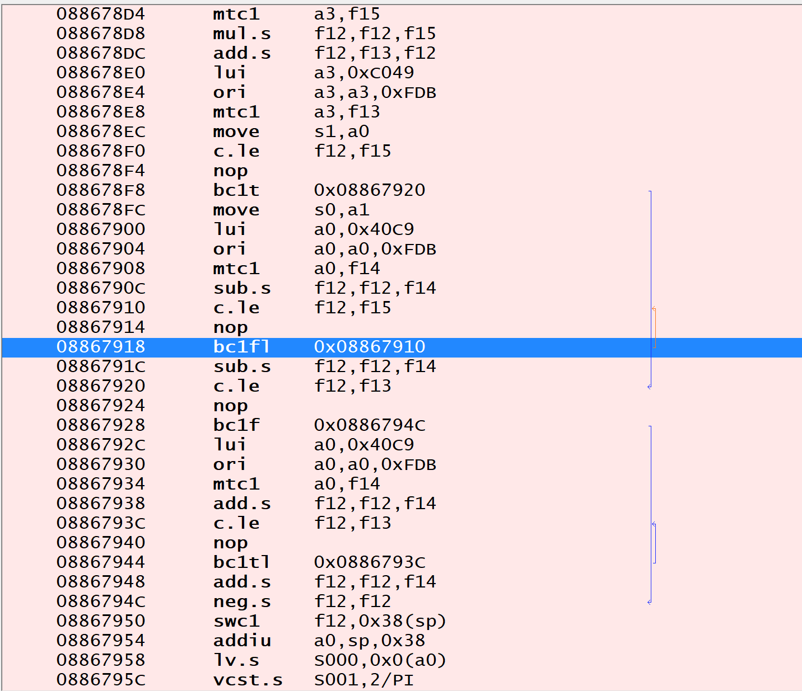
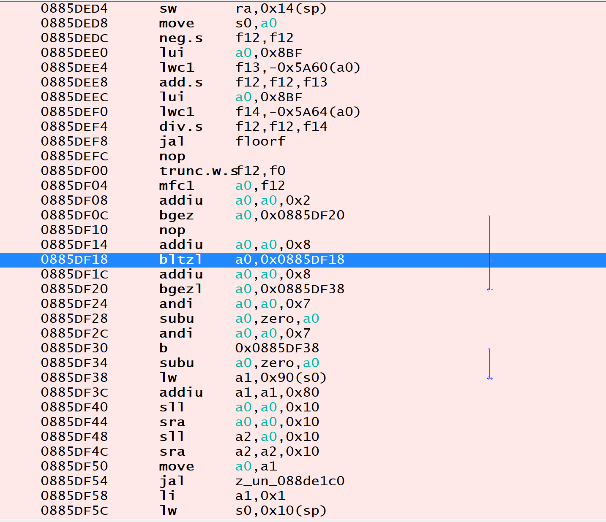

# Sims2Pets - Find and NOP unescapable loops

## Prelude - Sims 2 Castaway loops

### Loop №1

```
460D703E
00000000
4502FFFD

460C703E
00000000
4503FFFD
```

### Loop №2

```
4616A03E
00000000
4502FFFD
```

### Loop №3

```
460F603E
00000000
4502FFFD
```

### Loop №4

```
0482FFFF
```

 |  
---- | ----
 | 

## Sims2Pets: One-line loops

### Hypothetical
*Register: Instruction::HEX*

#### bltzl

```
z0: 0402FFFF
at: 0422FFFF
v0: 0442FFFF
v1: 0462FFFF
a0: 0482FFFF
a1: 04A2FFFF
a2: 04C2FFFF
a3: 04E2FFFF
```

#### bgtzl

```
z0: 5C00FFFF
at: 5C20FFFF
v0: 5C40FFFF
v1: 5C60FFFF
a0: 5C80FFFF
a1: 5CA0FFFF
a2: 5CC0FFFF
a3: 5CE0FFFF
```

### Results
*Address: Instruction::ASM (Instruction::HEX)*

```
0885AC84: bltzl a0, 0x0885AC84  (0482FFFF)
088FDAA4: bltzl a1, 0x088FDAA4  (04A2FFFF)
```

## Sims2Pets: Multi-line Loops 
*(starting addresses)*

```
08855210 - 
08855240 - 

08859A14 - 
08859A44 - 

0885AA78 - Move character uncommon?/
0885AAA4 - Move character uncommon?/

0885ADD8 - Random?/
0885AE00 - Unk?/

08864E24 - 
08864E50 - 

08864F34 - PARK1/Pets
08864F64 - 

08865090 - Park?/
088650B8 - ?

08865F38 - 
08865F64 - 

08866070 - Park?
088660A0 - ?

088661CC - ?
088661F4 - ?

0887DAD4 - Move character? rare/ 
0887DB00 - Move character?

0887DBE0 - ?
0887DC0C - ?

0888C360 - Start moving character?
0888C38C - Park toilet movement?/

08968354 - 1
08A7BB94 - 1 
08A7BC5C - 1
08AAC298 - 1/Park sometimes?/

08AB5FA8 - After load?/
08AB6140 - ?
08AB7064 - Park uncommon?/


08AF6ED4 - 
08AF6F00 - 
08AF6F2C - Move UP/DOWN?/
08AF6F58 - 
```

### Additional but longer loops
*(longer loops)*

```
08AF6F88 - 
08AF6FB8 - Common call?/
08AF6FF0 - 
08AF7020 - 
08AF7054 - 
08AF7084 - 


08B106F0 - 
```

### Code examples
*(Assembly code in HEX)*

```
460D703E
00000000
4502FFFD

460C703E
00000000
4503FFFD

460C703C
00000000
4503FFFD

460E603E
00000000
4502FFFD

460F603E
00000000
4503FFFD
```

#### Code examples - longer
*(Assembly code in HEX - longer loops)*

```
460C6C01
461C803E
00000000
4502FFFC

460C6C41
461E883C
00000000
4503FFFC
```

### Code endings all
*(Assembly code endings in HEX - longer loops)*


```
4502FFFC
4502FFFD
4503FFFC
4503FFFD
```

## Results

* NOP one-line loops - no remarkable gameplay improvement, no apparent change to the gameplay.
* NOP multi-line semi-explored loops - no remarkable gameplay improvement, no apparent change to the gameplay.
* NOP multi-line explored loops - no remarkable gameplay improvement, no apparent change to the gameplay.
* NOP all multi-line loops (including unexplored) - multiple changes, 
	* No remarkable gameplay improvement.
	* Body bones begin glitching out of sight.
	* Pets fall slightly through ground.
	* Side movement occasionally disrupted/disrupted at some places.
	* Pets begin acting erratically.
	* Camera acts really erratically. Normally, the camera is far less buggy.
	* Fridge doors appear open for no reason.
	* Actions do not get committed to the action queue.
	* Sims struggle to reach waypoints.
	* **However,** the game doesn't crash.

## Trivia

According to the online reports, escaping 'unescapable' loops in Sims2Castaway remarkably improves gameplay (by allowing Sims and Chimps to spawn without forcing player to wait). Similar effect was not observed in Sims2Pets.

Calling these loops unescapable is somewhat incorrect, as 'unescapable' may imply that the CPU is stuck at their execution. To be fair, this was the behavoior during the period of incorrect PPSSPP emulation of certain gameplay artifacts. As such, is more correct to call these loops `wait()` loops, `await` loops, or `wait-state` loops, as these loops wait for another asyncronous thread.

Here is somewhat similar Python code: https://docs.python.org/3/library/asyncio-task.html#awaitables

## Conclusion

When it comes to unescapable (await) loops, Sims2Pets loops are do not detriment gameplay as much as Sims2Castaway loops may do. Escaping unescapable (await) loops in Sims2Pets does not remarkably improve gameplay. Furthermore, PPSSPP emulation is at a better state in 2024 than it was previously, and Sims2Castaway (and similar) thread artifacts do not cause any emulation problems that require unescapable (await) loops patching out with NOP.

As such, for Sims2Pets - Find and NOP unescapable loops action is not helpful nor required.

## Extras

ArtMoney table for testing was uploaded, discover: [ULUS10130.amt](./ULUS10130.amt)

---------------------------------

***[Tim Abdiukov](https://github.com/TAbdiukov)***
