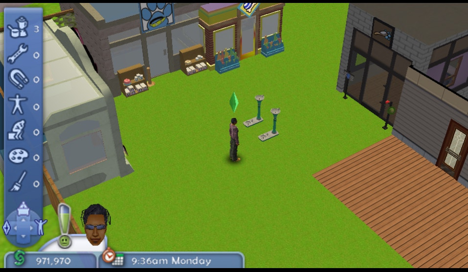

## How this rare-earth element was found

I previusly tried to analyze and research the operation of in-game entities through Actions. The game stores action data / logic (all the same) all over its RAM, and everything is dynamic, so it is difficult to follow. However, the same stores the current object title (printed in the action menu) at a static address!

Through some PPSSPP debugger purgatory, I found where the same fetches the struct that stores the said object name.

From that struct, I found a chain of structs connected to the functioning of the said object. I didn't go up all the way in the chain where mathematical computations of pointer address(es) occur, but I went up to,

```
{{more global pointers}}
-> 09B9EA1C (Object behavior in RAM) + 00E4 
-> 09C4F6BC (Obj type actions) + 007C 
-> ** 09B6534C (Obj type buymenu) ** + 009C 
-> 09B6536C (???) + 000C
-> 09C6383C (???) + 0000
-> 08EA54B4 (???) + 0000
-> 08F3502E (Object name)
```

The addresses are static already at this point. Through trial and error, I discovered that the pointer of `-> ** 09B6534C (Obj type buymenu) ** + 009C ` (in the example above) corresponds to the object functioning in the buymenu.

It is worth mentioning that the game mixes execution and control flow, a normally very unsafe coding practice. As a result of it, there are buymenu bugs: computers and lights turn on in the buy menu. As such, it is possible to get the game to execute code from just getting the game to interpret an object's buymenu address through committing to buy it in the buy menu!

Interestingly, it's possible to turn Sims into trash or dust, or into a dog. It's just that the game engine really doesn't like it (the game crashes once you go to park). You may be able to discover more using the following ArtMoney (AMT) table: [SinkOdyssey.amt](./SinkOdyssey.amt)  


## Legend 

```
{Object}: {Action Address} {Execution Address} {Other}
```

### Generic

```
Green bed: 09B45E08
Trash: 09B79960 09B79960
Newspaper: 09B57D88
Kate: 09B37BF0
Buster: 09B1BC18
Deltoid: 09B1CE08
Carpool: 09B64BC8 09B64A38
Arcade: 09B53030

Linda: 09B1C140 09B1C140

DeBingo  chair (1): 09B4BB00 09B4BB00
Computer chair (2): 09B6A668 09B6A668
```

### Park

```
Pet bakery:       09B47D48 09B47AF0
Pet Kennel:       09B49580 09B49328
Pet Emporium:     09B49BC0 09B49968
Pet Purveyors:    09B4A200 09B49FA8
Pet Salon (Wash): 09B4A9D0 09B4A778
Pet Toy Store:    09B4B010 09B4ADB8

Park phone: 09B53418 09B53418
ATM:       09B61518 09B61518
Fountain:  09B61770 09B615E0 9D5A300

Coffee Cart:         09B482C0 09B481F8


Drink Water machine: 09B54160 09B54160
HotDog Vending Mach: 09B54228 09B54228

Go to town square:   09B652D0 09B652D0
```

## Lamps

Breakpoint at address **execution**: `08A3F294`

s3 is **PtrValue** (at least during ~70% of hit breakpoints)

## Chairs

Note: ID numbers are decimal. `f` for "fixed".

```
ID	Containr	PtrValue
01	09B4BB7C	09B4BB00
02	09B6A6E4	09B6A668
03	09B4B924	09B4B8A8
04	09B6B044	09B6AFC8
05	09B4BC44	09B4BBC8
06	09B4BAB4	09B4BA38
07	09B6AD24	09B6ACA8
08	09B4B9EC	09B4B970
09	09B6A48C	09B6A410
10	09B6ADEC	09B6AD70
11	09B6AEB4	09B6AE38
12	09B6D68C	09B6D548
12f	09B6D5C4	09B6D548
13	09B6AACC	09B6AA50
14	09B6A554	09B6A4D8
15	09B6AB94	09B6AB18
16	09B6E0B4	09B6DF70
17	09B6AC5C	09B6ABE0
18	09B6F504	09B6F3C0
19	09B6A93C	09B6A8C0
20	09B6B10C	09B6B090
21	09B6AF7C	09B6AF00
22	09B6E30C	09B6E1C8
23	09B6E564	09B6E420
24	09B6A7AC	09B6A730
```
