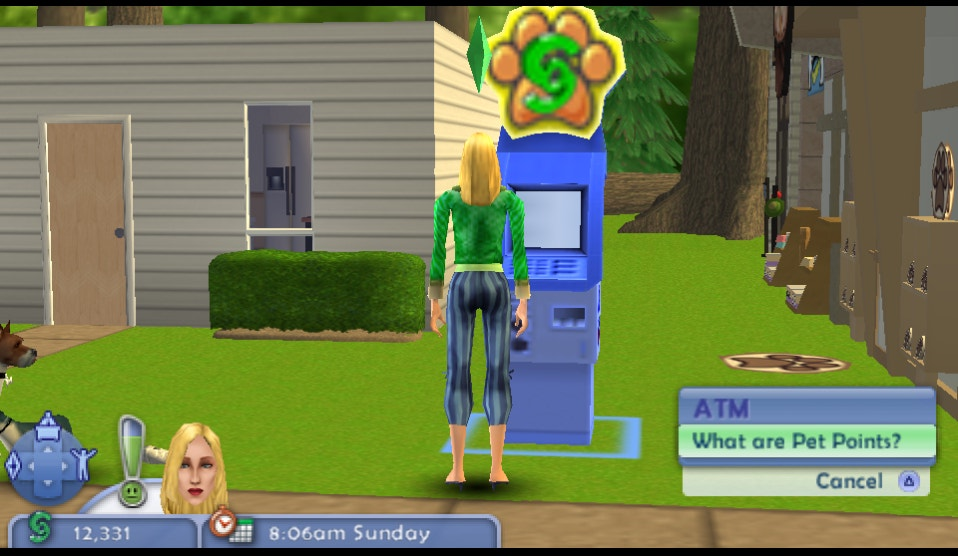

# Sims2Pets-action_options
## Significance

  

Sims2Pets blocks some ATM actions when at Home and not in Park.

Unfortunately, this hack is unfinished, because (while expecting it to be an easy and fun project) it turned out to be too difficult to navigate, asyncronous spaghetti code with too many I/O redundancies. This hack ended up being simply not worth it.

# Utilized addresses  
  
Utilized addresses found, and they are static  
```  
08F0F99C - "Exchange $ to ¢"  
08F0F9BC - "What are Pet Points?"  
```  
  
# Breakpoint on each addresses  
  
Breakpoint on read. One byte is enough for the task  
  
## At home  
  
```  
08B5E7C8: read 08F0F99C, afterwards jr to 0893EA4C  
08B5E7C8: read 08F0F99C, afterwards jr to 0893EB2C  
08B5E7C8: read 08F0F9BC, afterwards jr to 0893EA4C  
08B5E7C8: read 08F0F9BC, afterwards jr to 0893EB2C  
  
08B5E7C8: read 08F0F99C, afterwards jr to 0893EA4C  
08B5E7C8: read 08F0F99C, afterwards jr to 0893EB2C  
08B5E7C8: read 08F0F9BC, afterwards jr to 0893EA4C  
08B5E7C8: read 08F0F9BC, afterwards jr to 0893EB2C  
  
08AE0FEC: read 08F0F9BC (long), afterwards jr to 0897AA4C  
0897B8C8: read 09C175E8 (?, according to debugger stats)   
```  
  
## In park  
  
```  
08B5E7C8: read 08F0F99C, afterwards jr to 0893EA4C  
08B5E7C8: read 08F0F99C, afterwards jr to 0893EB2C  
08B5E7C8: read 08F0F99C, afterwards jr to 0893EA4C  
08B5E7C8: read 08F0F99C, afterwards jr to 0893EB2C  
  
08B5E7C8: read 08F0F9BC, afterwards jr to 0893EA4C  
08B5E7C8: read 08F0F9BC, afterwards jr to 0893EB2C  
  
08AE0FEC: read 08F0F9BC (long), afterwards jr to   
  
  
0897AA4C -→ 088D5640 -→ 08850158 (088502A8) -→ 0882DDD4 -→ 0882D794 -→ 0887E06C -→ 0888F85C -→ 08890D40 -→ 0887EA64 -→ 0894AE04  
  
0897B8C8: read ?   
08AE0FEC: read 08F0F9BC (long), afterwards jr to 0897AA4C -→ 088D5640 -→ 088502A8 -→  
```  
  
  
## NOPping instuctions  
  
```  
08B5E7C8 - no effect  
0897B8C4 - empty texts  
0897B8C8 - text corruption  
```  
  
## another breakpoint  
  
At execution of 0x08AE0FEC , condition: **`a0==08F0F9BC`**  
  
```  
0882DDCC -→ 0885014C (forces game to reload logic!) -→ 088D5634 (3+1 calls, fetches names for Object actions) -→ 0897AA40  
```  
  
  
3 calls are defined between: `0885014C` and `088D5634`,  
  
```  
Call 1 at: 08850150  
Call 2 at: 088502A0  
Call 3 at: 088502A0  
```  
  
# New functions to check  
  
```  
0882DCF8  
0882DDC8  
```  
  
```  
Home: 0882DD4C -→ 0882D794 -→ 0887E06C -→ 0888F85C -→ 08890D40 -→ 0887EA64 -→ 0894AE04 -→ 08944710 -→ 0894BA1C -→ 08943848 -→ 08943A34 -→ 08944C7C -→ 08944220 -→ 08944100 -→ 08811CFC -→ 088113A4 -→ 08A964DC -→ 08A91470  
Park: (same)  
```  
  
NOP: 0882D78C - break actions  
  
# Park extra address values  
  
```  
09FFF260+0x34: 09D47790 (unconfirmed)  
09FFF260+0x34: 09D17068  
-→ 09D19190 (set in 088F6838)  
09FFF260+0x34: 09D19340   
```  
  
**`a1= 09D19D68`**  
  
# Save3  
  
  
```  
09D1AAF0 (1)  
09D172A0 (2)  
09D56F68 (3)  
```  
  
# Watching change  
  
### Park  
  
occurred in  
```  
0897A42C -→ 088D5418 -→ 088F6534 -→ 088F6904 -→ ...  
```  
  
  
### Home  
```  
0897A42C -→ 088D5418 -→ 088F6534 -→ 088F6904 -→ 0893EB64 -→ 08809F48 -→ 08809C70 -→ 0881C344 -→  
08890174 -→ 0888FC14 -→ 0887DF34 -→   
```  
  
## Finding golden address  
  
golden address = Only 1 call,  
  
```  
08809F48 - per X press  
0893EB64 - per X press  
088F6900 - per action count + 1  
088F6534 - per action count + 1  
```  
  
None found...  
  
# Watching №1+0x4  
  
```  
Found: 088F654C  
-→ 088F6904 -→   
-→ 0893EB64 -→ 08809F48 -→ 08809C70 -→ 0881C344  
-→ 0882DD44 -→ 0882D794 -→ 0887E06C -→   
```  
  
## Home  
  
NONE  
  
  
### Partial Conclusion  
  
  
along the lines of,  
```  
088F6534 (action+1)  
088F654C (№1+0x4)  
088F6900 (Xpress lite)  
```  
  
  
The following detections occur,  
```  
12 12 123 123  
```  
  
So, I speculate this is a 'streaming function', waiting for the other thread  
  
  
## Call list capture  
  
```  
09D1AAF0: 09D16818  
09D1AAF4: 09D5C4D8  
09D5C4D8: 08C01920  
09D5C4DC: 09D5B890  
09D5B890: 08C01920  
09D5B894: 00000000  
```  
  
Addresses for change to next list node ptr: 08AF7CB8 and 08AF7CBC  
  
### 08AF7CB8 (StepOut+)  
  
```  
-→ 08ADF174 (NOP=crash)  
-→ 08ADEF64 (NOP=crash)  
-→ 08ADECFC (NOP=crash)  
-→ 08AA45A8 (NOP=crash)  
-→ 08AA3BD8  
-→ 08835D48  
-→ 088113C8  
-→ 08A964DC  
-→ 08A91470  
```  
  
  
## Values alt  
  
```  
09D5F128: 09D16818  
09D5F12C: 09D17C00  
09D17C00: 08C01920  
09D17C04: 09D00890  
09D19CB0: 08C01920  
09D19CB4: 00000000  
```  
  
№1+0x4 write: 088F654C  
```  
-→ 088F6904  
-→ 0893EB64  
...  
```  
  
№2+0x4 write: 088F654C  
  
  
**`088F6544...`** - function of list entry generation  
  
# Other - researching POI in 088F6904  
  
```  
→ 088F652C  
→ 088F64F0  
→ 088D5410  
  
  
Interesting jal: 0897A414: 	jal	z_un_089797d4  
  
→ 088F6514  
→ 08ADECF4  
```  
  
## Misc  
  
* It is possible to *reduce* the number of actions to 1, by NOPping conditional goto commands at `088503D8` and `088503EC` (causing executions of `088502A0`). However, since the game uses linked-lists to store commands (more accurately, sausage code of bucketed listed-lists linking linked-lists), this action just cripples in-game logic slightly.  
  
  
## Tries  
  
### park  
  
0893F294 - 0xC - x1  
088B872C - 0x4 - x4  
0893F294 - 0xC - x1  
088B872C - 0x4 - x4  
  
0893F294 - 0xC - x1  
088B872C - 0x4 - x3  
0893F294 - 0xC - x1  
088B872C - 0x4 - x3  
  
088B8728 - not   
  
### Home  
  
0893F294 - 0xC - x1  
088B872C - 0x4 - x3  
  
→ 088B872C → 088B82C8 → 089012B0 → 08901B8C → 0893F2B0 → 088F68C4 → 0893EB64   
  
(x3 runs)  
--→ 08809F48 → 08809C70 →   
  
(x2 runs)  
--→ 0881C344 → 08890174 →   
  
(x1 run)  
0888FC14 → 0887DF34 → 0888F85C → 08890D40 → 0887EA64  -→ 0894AE04 ....  
  
0893F294 - 0xC - x1  
  
#### At home  
  
0888FC38 (False) -→ 0888FC54 (b) -→ 0888FC8C (false) -→ 0888FCBC (false) -→ 0888FD00 (true)  
-→ 0888FDF4 (true) -→ 0888FD00 (true again) -→   
→ 0888FDF4 (true) -→ 0888FD00 (true again) →   
→ 0888FDF4 (true) -→ 0888FD00 (true again) → 0888FDF4 (false)  
  
#### park  
  
0888FC38 (False) → 0888FC54 (b) -→ 0888FC8C (false) -→ 0888FCBC (false) -→ 0888FD00 (true)  
→ 0888FD00 (true) → 0888FDF4 (true) →   
→ 0888FD00 (true) → 0888FDF4 (true) →   
→ 0888FD00 (true) → 0888FDF4 (true) →   
→ 0888FD00 (true) → 0888FDF4 (true) →   
→ 0888FD00 (true) → 0888FDF4 (false) →   
  
088B872C - 0x4 - x3  
  
→ 088B872C -→ 088B7A08 -→ 088B6CA0 -→ 08901AD8 -→   
→ 088B82C8 -→   
→ 088B7A08 →   
→ 088B83E4 → 089012B0 → 08901B8C → 0893F2B0 → 088F68C4 → 0893EB64 →   
  
0893F294 - 0xC - x1  
088B872C - 0x4 - x4  
  
0893F294 - 0xC - x1  
088B872C - 0x4 - x3  
0893F294 - 0xC - x1  
088B872C - 0x4 - x3  
  
  
## Try 0888F85C   
  
Previous: 0888F858  
Beginning: 0888F4C4  
  
### Home/park  
  
0888F854 (above) →  0888F860 (false) → 0888F868 (common call) → 0888F874 (false) → 0888F8F8 (false)  
  
  
## Try 0887DF34 ( 0887DF30)  
  
  
Beginning: 0887DE18  
  
### home  
  
0887DE44 (false) → 0887DE4C (JAL1)   
  
#### Home JAL1  
  
0895EF5C (jal)  
→ 0895D07C (true)  
  
→ 0895EF68 (false) → 0895EF84 (false) → 0895EF8C (jal) →  
  
→ 0895F424 → 0895F444 (false) → 0895F458 (false) → 0895F464 (false) →   
→ 0895F474 (false) → 0895F480 (true) → 0895F49C (true) →   
→ 0895F4B0 (jal 4 instructions) → 0895F4B8 (false) → 0895F4C4 (false) →   
→ 0895F4D0 (false) → 0895F4DC (false) → 0895F4E8 (false)  
  
 0895EF94 (false)  
  
#### Back  
  
→ 0887DE54 (false) → 0887DE60 (false) → 0887DE74 (true) → 0887DF24 (JAL2)   
  
#### JAL23  
  
##### Jal 2  
0887BD28 (false) → 0887BD30 (jal 3 instructions) → 0887BD3C (false)    
  
##### JAL 3  
0887DF2C → 0888FBAC (jal 3.1)   
  
###### jal 3.1  
  
0882A764 → 0882A768 (false) → 0882A770 (false) → 0882A778 (b)   
→ 0882A794 (false) → 0882A7B4 (loop 10+)  
  
###### Back to jal 3  
  
0888FBE0 (false) → 0888FBF0 (false) → 0888FC0C (jal skip)   
→ 0888FC14 (false) → 0888FC2C (jal) →  
→ 0888FC38 (false) → 0888FC48 (jal) → 0888FC54 (b)   
→ 0888FC7C (jalr) → 0888FC8C (back false)  
→ 0888FCBC (false) → 0888FCF8 (jal)   
→ 0888FD00 (TRUE)  
→ 0888FDF4 (known location)  
  
  
###### investigating JAL 3.2 .. 3.4  
  
  
  
#### Back  
  
→ 0887DF34 (Known "having already started" cutoff point)  
→ 0887DF38 (JAL4, out of scope)  
→ 0887DF44 (JAL5, out of scope)   
  
→ 0887DF50 (false) → 0887DF5C (true) →   
→ 0887DFF4 (true) → 0887E058 (false) → 0887E064 (JAL6)   
→ 0887E06C (false) → 0887E078 (true) →   
  
### Park  
  
0887DE44 (false) → 0887DE4C (JAL1)   
  
#### Park JAL1  
  
0895EF5C (jal)  
→ 0895D07C (true)  
  
→ 0895EF68 (false) → 0895EF84 (false) → 0895EF8C (jal) →  
  
→ 0895F424 → 0895F444 (false) → 0895F458 (false) → 0895F464 (false) →   
→ 0895F474 (false) → 0895F480 (true) → 0895F49C (true) →   
→ 0895F4B0 (jal 4 instructions) → 0895F4B8 (false) → 0895F4C4 (false) →   
→ 0895F4D0 (false) → 0895F4DC (false) → 0895F4E8 (false)  
  
 0895EF94 (false)  
  
  
#### Back (old)  
  
0887DF50 (false) → 0887DF5C (true) →   
0887DFF4 (true) → 0887E058 (false) → 0887E06C (false) → 0887E078 (true)  
  
#### Back (home)  
  
→ 0887DE54 (false) → 0887DE60 (false) → 0887DE74 (true) → 0887DF24 (JAL2)   
  
  
#### JAL23  
  
##### Jal 2  
0887BD28 (false) → 0887BD30 (jal 3 instructions) → 0887BD3C (false)    
  
##### JAL 3  
0887DF2C → 0888FBAC (jal 3.1)   
  
###### jal 3.1  
  
0882A764 → 0882A768 (false) → 0882A770 (false) → 0882A778 (b)   
→ 0882A794 (false) → 0882A7B4 (loop 10+)  
  
###### Back to jal 3  
  
0888FBD4 (jal 3.2)  
  
(skip jals 3.x)  
...  
  
  
0888FBE0 (false) → 0888FBF0 (false) → 0888FC0C (jal skip)   
→ 0888FC14 (false) → 0888FC2C (jal) →  
→ 0888FC38 (false) → 0888FC48 (jal) → 0888FC54 (b)   
→ 0888FC7C (jalr) → 0888FC8C (back false)  
→ 0888FCBC (false) → 0888FCF8 (jal)   
→ 0888FD00 (TRUE)  
→ 0888FDF4 (known location)  
  
  
#### Back  
  
→ 0887DF34 (Known "having already started" cutoff point)  
→ 0887DF38 (JAL4, out of scope)  
→ 0887DF44 (JAL5, out of scope)   
  
→ 0887DF50 (false) → 0887DF5C (true) →   
→ 0887DFF4 (true) → 0887E058 (false) → 0887E064 (JAL6)   
→ 0887E06C (false) → 0887E078 (true) →   
  
## Listing jals 3.x  
  
See: **[Sims2Pets-action-JALs-3.x.md](./Sims2Pets-action-JALs-3.x.md)**  
  
* 0888FBAC (3.1, investigated)  
* 0888FBD4 (3.2)  
* 0888FC0C (3.3)  
* 0888FC2C (3.4, jalr)  
* 0887DF34 (Known "having already started" cutoff point)  

## Overall Conclusion  
  
Useful calls for debugging action list entries,  
```  
Call 1 at: 08850150  
Call 2 at: 088502A0  
Call 3 at: 088502A0  
```  
  
Useful calls for debugging action list *overall*,  
```  
088F6534 (action+1)  
088F654C (№1+0x4)  
088F6900 (Xpress lite)  
```  
  
Don't feel like dealing with incredible spaghetti code that's multithreaded and accounting for UMD streaming delays and containing IO redundancies. What was meant to be a fun little project become a time sink.  
