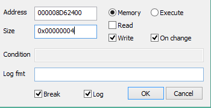
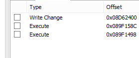

TDU TP Anywhere project P2

# TDU TP Anywhere project P2
## Part II

### Process
#### Attempt 1
Hooking on Marker X write ( 000008D62400)



* Write at 089F158C (seemingly always only here) 
* Also hook on 089F1498 (routine begin)





Branches before

Legend
* `S` - skipped for a good reason
* `+` - branch (condition = true)
* `-` - no branch (condition = false)
* `C` - cancaded (skipped) no branch
* `N` - never executed
* RA - return address (after func)

Attempt 3 legend extension
* `L` - explicit landing
* `O` - steppable over (no execution hijacked)
* `B` - unconditional branch
* `F` - executed, no need to continue debugging - further routine out of scope
* `e` - executed

Address | Landmark (Realtor) | Undiscovered landmark (Car svc) | Far outback w/o approximation | Far Water | Outback with existing closest point | Road with crosshair | Presumed Meaning |
---- | ---- | ---- | ---- | ---- | ---- | ---- | ----
089F1498 | +  | + | N | + | + | + | IDK |  
089F14A8 | C | C | N | C | C | C | |
089F14B0 | - | - | N | - | - | - | |
RA = | 08A1F748 | 08A1F748 |  | 08A1F878 | 08A1F878 | 08A1F878 |

```
08A1F878: 	jal	z_un_089f1498
```

going up the stack, since always the same caller

#### Attempt 2


> 08A1F748 != 08A1F**8**78
> The latter used for non-landmark purposes?


* Hook on 08A1F748
* ~~Hook on function start: 08A1EC74~~ Executed on unzooming

* Bunch of random jump hooks beginnning 08A1F**74**8

Note: parameters shuffled around for my own convenience

Address | Farthest Water  | Outback with existing closest point | Road with crosshair  |  Far outback w/o approximation |  Presumed Meaning |
---- | ---- | ---- | ---- | ---- | ---- |
08A1F750 | S | S | S | **N** | Goto function end `	b	pos_08A1F880`
08A1F778 | + | + | + | N | JAL = call sub-function 
08A1F788 | + | + | + | N | JAL = call sub-function 
08A1F790 | - | - | - | N | | 
08A1F7A0 | - | - | - | N
08A1F7C8 | + | + | + | N
08A1F7E8 | C | C | C | N
08A1F808 | C | C | C | N
08A1F828 | C | C | C | N
08A1F844 | - | + | - | N | Is "Water"
08A1F84C | + | C | + | N | Just a `b` (branch always) - either `+` or `C`
08A1F854 | - | - | - | N | 
08A1F878 | + | + | + | **-** | Should always be a plus, because is checked against
RA | S | S | S | S | S |

#### Attempt 3

Found some interesting things in the process
* undocumentws islands (in the future, **u-islands**) act like "Far outback w/o approximation" as far as the marker is concerned
* If I try to put a marker on a u-island, and have a breakpoint in the beginning of a function, the breakpoint is hit. So we establish where to begin searching in depth!

So what I'll try to is follow the steps of attempting to set a marker on a u-isaland, and try to follow assembly from the beginning of the function. Then check how the behaviour is different to non-abnormal cases. That's assuming execution isnt hijacked (by an exception or something)

***NOTE***: The number (for example, 2 in "  Outback w/ closest point 2  " - means the consecutive call number occurs within one frame

Address | U-island 1 | U-island 2 | Outback w/ closest point 1|  Outback w/ closest point 2 | 
---- | ---- | ---- | ---- | ---- |
Supposed meaning | marker prep? | strings? | marker recon/prep?  | 
08A1EC74 | + | + | + | + |
08A1ECB8 | + | + | + | + 
08A1ECC4 | C | C | C | C
08A1ED08 | - | + | - | +
08A1ED18 | - | | -
08A1ED28 | - | | -
08A1ED38 | - | | -
08A1ED48 | - | | -
08A1ED58 | - | | -
08A1ED68 | - | | -
08A1ED78 | - | | -
08A1ED88 | - | | -
08A1ED94 | - | | -
08A1EDA4 | - | | -
08A1EDB4 | - | | -
08A1EDC0 | - | | - 
08A1EDCC | - | | - 
08A1EDD8 | - | | - 
08A1EDE4 | - | | -
08A1EDF4 | - | | -
08A1EE04 | - | | -
08A1EE14 | - | | -
08A1EE24 | - | | -
08A1EE30 | - | | -
08A1EE3C | - | | -
08A1EE48 | - | | -
08A1EE54 | - | | -
08A1EE60 | - | | -
08A1EE70 | - | | -
08A1EE7C | - | | -
08A1EE88 | - | | - 
08A1EE98 | + | | +
08A1F070 | L | | L
08A1F08C | O | | O
08A1F09C | O | | O
08A1F0C0 | O | | O
08A1F0D0 | O | | O
08A1F0E4 | - | | -
08A1F0F0 | + | | +
08A1F0FC | L | | L
08A1F0FC | - | | -
08A1F108 | - | | **+** (not imp?)
08A1F120 | O | | O
08A1F12C | + | | **-** (same logic as 08A1F108)
08A1F140 | L | | e |
08A1F148 | O | | O |
08A1F154 | B | | B |
08A1FB4C | n | O (strcmp) | F | O
08A1FB54 | n | + | F | +
08A1FB6C | L (stack ra prep) | F | F | F 
08A1FB80 | JR RA | F | F | F

~~Table is incomplete, as I probably need to compare "U-island 2" and "Outback w/ closest point 2", but dont wanna make the table bloated~~ 

Table is fine, 3.2 wasnt needed
###### 3.2

Address | Outback w/ closest point 2 | U-island 2 
---- | ---- | ---- |
Notes | Sth quick | Sth quick 
08A1EC74 | + | +
08A1ECB8 | + | +
08A1ECC4 | C | C
08A1ED08 | + | +
08A1FB4C | O | O (strcmp) |
08A1FB54 | + | + | 
08A1FB6C | | F |
08A1FB80 | | F |

No luck? These are some quick unimprortant ops

Update: Should've compared Outback w/ closest point **3** with... Nothing?

###### 3.3

Interesting opcode while investigating both Outback w/ closest point 1 and U-island 1

``` 
08A1F0D8: 	andi	s1,v0,0xFF
```

This is a bitwise and between v0 and 0xFF. Effectively, it just takes the lowest 1 byte of v0 and stores it into s1

Now here it gets interesting

s1 is later conditionally stored into v0 (iff s1 > 0), and v0 used for the suspicious 08A1F108 and 08A1F12C jumps - the only found differences in execution between Outback w/ closest point 1 and U-island 1

Try: Change it to `li s1, 1` (the Outback w/ closest point 1 value)

Good news and bad news! Now the game makes the `Success` sound, but the game still approximates the marker pos


Prep for CWCheat
===

Old
```
08A1F0D0: 	jal	z_un_08a290dc
...
08A1F0D8: 	andi	s1,v0,0xFF
```

New
```
08A1F0D8:	li	s1,0x1
```


Type | Address | old HEX | new HEX   
---- | ---- | ---- | ----
before chk | 08A1F0D0 | 0E28A437 | -
main | 08A1F0D8 | 305100FF | 34110001


Cwcheat
====

```
// lets you put the marker anywhere (even in the no-go areas), 
// though it still "approximates" to the appropriate marker pos
// this hack brings teleportation anywhere one step closer
// assert 08A1F0D0 == 0E28A437
// modify 08A1F0D8 thereafter ( 305100FF -->  34110001 ) 
_C0 TP hack - Disobey land-marking blacklist [Enable]
_L 0xE004A437 0x0021F0D0 // check, 1/4, characteristic "jal" call 
_L 0xE0030E28 0x0021F0D2 // check, 2/4, characteristic "jal" call 
_L 0xE00200FF 0x0021F0D8 // check, 3/4, "andi s1,v0,0xFF"
_L 0xE0013051 0x0021F0DA // check, 4/4, "andi s1,v0,0xFF"
_L 0x2021F0D8 0x34110001 // new opcode
//
_C0 TP hack - Disobey land-marking blacklist [Disable]
_L 0xE004A437 0x0021F0D0 // check, 1/4, characteristic "jal" call 
_L 0xE0030E28 0x0021F0D2 // check, 2/4, characteristic "jal" call 
_L 0xE0020001 0x0021F0D8 // check, 3/4, modded opcode
_L 0xE0013411 0x0021F0DA // check, 4/4, modded opcode
_L 0x2021F0D8 0x305100FF // orig opcode
//
```
